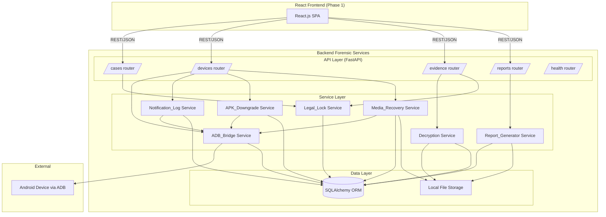
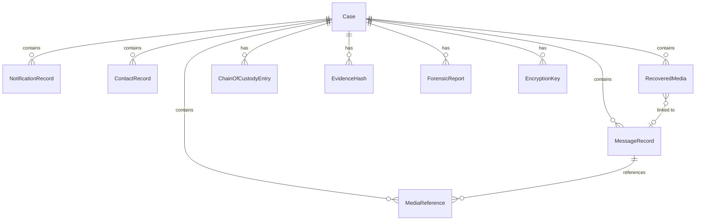

# Design Document: Backend Forensic Services

## Overview

The Backend Forensic Services is a standalone Python 3.11+ FastAPI application that provides real forensic investigation capabilities to replace the mock JSON data used by the Phase 1 React frontend. It communicates with Android devices via ADB, performs WhatsApp APK downgrade and encryption key extraction, decrypts WhatsApp databases, extracts notification logs, recovers deleted media, generates court-admissible PDF reports, and enforces evidence integrity through cryptographic hashing and chain of custody.

The backend exposes a REST API that the Phase 1 React frontend consumes directly. It is a separate project with its own repository, dependencies, and deployment.

### Key Design Decisions

1. **Service-oriented architecture**: Each forensic domain (ADB, decryption, notifications, media recovery, reporting, legal lock) is encapsulated in its own service class with a defined interface. This keeps concerns separated and allows independent testing.
2. **SQLAlchemy + SQLite for development, PostgreSQL for production**: SQLAlchemy ORM provides database abstraction. SQLite is used for development/testing; PostgreSQL is the production target.
3. **Hypothesis for property-based testing**: The `hypothesis` library is used for PBT to validate correctness properties derived from requirements.
4. **Pydantic for API schemas**: FastAPI's native Pydantic integration handles request/response validation and serialization.
5. **Async where beneficial, sync for ADB**: ADB operations are inherently synchronous (subprocess calls). API endpoints use async handlers but delegate to sync service methods via `run_in_executor` where needed.
6. **Append-only chain of custody**: Chain of custody entries are insert-only at the database level. No UPDATE or DELETE operations are permitted on the `chain_of_custody_entries` table.

## Architecture



### Layer Responsibilities

- **API Layer**: FastAPI routers that handle HTTP request/response, input validation (Pydantic), authentication context, and CORS. Thin layer that delegates to services.
- **Service Layer**: Domain logic. Each service encapsulates one forensic capability. Services depend on the data layer and may depend on other services (e.g., Notification_Log_Service depends on ADB_Bridge).
- **Data Layer**: SQLAlchemy models and repository functions. File storage for binary artifacts (APK backups, recovered media, generated PDFs, encryption keys).


## Components and Interfaces

### Service Interfaces

Each service is defined as a Python Protocol (structural typing) to enable testing with mocks/fakes.

#### ADB_Bridge Service

```python
class ADBBridgeService(Protocol):
    def discover_devices(self) -> list[DeviceInfo]: ...
    def connect(self, serial: str, investigator_id: str) -> ConnectionResult: ...
    def disconnect(self, serial: str, investigator_id: str) -> bool: ...
    def get_connection_status(self, serial: str) -> ConnectionState: ...
    def pull_file(self, serial: str, remote_path: str, local_path: str, investigator_id: str) -> FilePullResult: ...
    def execute_shell(self, serial: str, command: str, investigator_id: str) -> ShellResult: ...
```

#### Notification_Log Service

```python
class NotificationLogService(Protocol):
    def extract_notifications(self, serial: str, case_id: str, investigator_id: str) -> NotificationExtractionResult: ...
    def get_notifications(self, case_id: str) -> list[NotificationRecord]: ...
```

#### APK_Downgrade Service

```python
class APKDowngradeService(Protocol):
    def execute_downgrade(self, serial: str, case_id: str, investigator_id: str, old_apk_path: str) -> DowngradeResult: ...
    def get_downgrade_status(self, case_id: str) -> DowngradeStatus: ...
```

#### Decryption Service

```python
class DecryptionService(Protocol):
    def decrypt_database(self, encrypted_db_path: str, key_id: str, case_id: str, investigator_id: str) -> DecryptionResult: ...
    def get_messages(self, case_id: str) -> list[MessageRecord]: ...
    def get_contacts(self, case_id: str) -> list[ContactRecord]: ...
    def get_media_references(self, case_id: str) -> list[MediaReference]: ...
```

#### Report_Generator Service

```python
class ReportGeneratorService(Protocol):
    def generate_report(self, case_id: str, investigator_id: str) -> ReportResult: ...
    def get_report(self, case_id: str, report_id: str) -> bytes: ...
```

#### Legal_Lock Service

```python
class LegalLockService(Protocol):
    def compute_and_store_hash(self, artifact_id: str, artifact_data: bytes, case_id: str, investigator_id: str, action_type: str) -> EvidenceHash: ...
    def verify_artifact(self, artifact_id: str, artifact_data: bytes, case_id: str, investigator_id: str) -> VerificationResult: ...
    def get_chain_of_custody(self, case_id: str) -> list[ChainOfCustodyEntry]: ...
    def log_custody_entry(self, case_id: str, investigator_id: str, action_type: str, artifact_id: str, evidence_hash: str) -> ChainOfCustodyEntry: ...
    def sign_report(self, report_data: bytes, signing_key_path: str) -> bytes: ...
```

#### Media_Recovery Service

```python
class MediaRecoveryService(Protocol):
    def scan_and_recover(self, serial: str, case_id: str, investigator_id: str) -> MediaRecoveryResult: ...
    def get_recovered_media(self, case_id: str) -> list[RecoveredMedia]: ...
    def get_media_file(self, case_id: str, media_id: str) -> bytes: ...
```

### API Routers

#### Cases Router (`/api/v1/cases`)

| Method | Path | Description | Request Body | Response |
|--------|------|-------------|-------------|----------|
| POST | `/` | Create a new case | `CreateCaseRequest` | `CaseResponse` |
| GET | `/` | List all cases | — | `list[CaseSummary]` |
| GET | `/{case_id}` | Get case metadata | — | `CaseResponse` |
| GET | `/{case_id}/messages` | Get message records | — | `DecryptedDatabaseEnvelope` |
| GET | `/{case_id}/notifications` | Get notification records | — | `NotificationLogEnvelope` |
| GET | `/{case_id}/contacts` | Get contact records | — | `list[ContactResponse]` |
| GET | `/{case_id}/media-references` | Get media references | — | `list[MediaReferenceResponse]` |
| GET | `/{case_id}/chain-of-custody` | Get chain of custody log | — | `list[ChainOfCustodyResponse]` |

#### Devices Router (`/api/v1/devices`)

| Method | Path | Description | Request Body | Response |
|--------|------|-------------|-------------|----------|
| GET | `/` | Discover connected devices | — | `list[DeviceInfoResponse]` |
| POST | `/{serial}/connect` | Connect to a device | `ConnectRequest` | `ConnectionResponse` |
| POST | `/{serial}/disconnect` | Disconnect from a device | `DisconnectRequest` | `StatusResponse` |
| POST | `/{serial}/pull-file` | Pull a file from device | `PullFileRequest` | `FilePullResponse` |
| POST | `/{serial}/shell` | Execute shell command | `ShellCommandRequest` | `ShellResponse` |
| POST | `/{serial}/extract-notifications` | Extract notification log | `ExtractNotificationsRequest` | `NotificationExtractionResponse` |
| POST | `/{serial}/apk-downgrade` | Initiate APK downgrade | `APKDowngradeRequest` | `DowngradeResponse` |
| POST | `/{serial}/recover-media` | Recover deleted media | `RecoverMediaRequest` | `MediaRecoveryResponse` |

#### Evidence Router (`/api/v1/evidence`)

| Method | Path | Description | Request Body | Response |
|--------|------|-------------|-------------|----------|
| POST | `/decrypt` | Decrypt a WhatsApp database | `DecryptRequest` | `DecryptionResponse` |
| POST | `/verify` | Verify evidence artifact integrity | `VerifyRequest` | `VerificationResponse` |
| GET | `/{case_id}/recovered-media` | List recovered media for case | — | `list[RecoveredMediaResponse]` |
| GET | `/{case_id}/recovered-media/{media_id}` | Download recovered media file | — | `FileResponse` |

#### Reports Router (`/api/v1/reports`)

| Method | Path | Description | Request Body | Response |
|--------|------|-------------|-------------|----------|
| POST | `/` | Generate a forensic report | `GenerateReportRequest` | `ReportResponse` |
| GET | `/{case_id}/{report_id}` | Download generated PDF | — | `FileResponse` |

#### Health Router (`/api/v1/health`)

| Method | Path | Description | Response |
|--------|------|-------------|----------|
| GET | `/` | Health check | `HealthResponse` |


### Pydantic Schemas (API Layer)

Key request/response schemas that ensure frontend compatibility:

```python
# Envelope format matching Phase 1 frontend expectations
class NotificationLogEnvelope(BaseModel):
    deviceIMEI: str
    exportDate: int  # Unix epoch ms
    entries: list[NotificationEntryResponse]

class NotificationEntryResponse(BaseModel):
    id: str
    sender: str
    content: str
    timestamp: int  # Unix epoch ms
    appPackage: str

class DecryptedDatabaseEnvelope(BaseModel):
    deviceIMEI: str
    exportDate: int  # Unix epoch ms
    entries: list[DecryptedDbEntryResponse]

class DecryptedDbEntryResponse(BaseModel):
    id: str
    sender: str
    content: str
    timestamp: int  # Unix epoch ms
    status: str  # "READ" | "DELIVERED" | "DELETED"
    isDeleted: bool
    readTimestamp: int | None
    deliveredTimestamp: int | None

class CaseResponse(BaseModel):
    caseNumber: str
    createdAt: int  # Unix epoch ms
    investigatorId: str
    deviceIMEI: str
    osVersion: str
    notes: list[str]
    dataSources: list[DataSourceSummaryResponse]

class DataSourceSummaryResponse(BaseModel):
    type: str  # "NOTIFICATION_LOG" | "DECRYPTED_DATABASE"
    fileName: str
    loadedAt: int
    recordCount: int

class ChainOfCustodyResponse(BaseModel):
    id: str
    timestamp: int
    investigatorId: str
    actionType: str
    artifactId: str
    evidenceHash: str
    description: str

class HealthResponse(BaseModel):
    status: str
    database: str
    adb: str
    version: str
```

## Data Models

### SQLAlchemy ORM Models



#### Case

```python
class Case(Base):
    __tablename__ = "cases"

    id: Mapped[str] = mapped_column(String(36), primary_key=True, default=lambda: str(uuid4()))
    case_number: Mapped[str] = mapped_column(String(50), unique=True, nullable=False)
    investigator_id: Mapped[str] = mapped_column(String(100), nullable=False)
    device_serial: Mapped[str | None] = mapped_column(String(100))
    device_imei: Mapped[str | None] = mapped_column(String(20))
    os_version: Mapped[str | None] = mapped_column(String(50))
    created_at: Mapped[datetime] = mapped_column(DateTime, default=datetime.utcnow)
    notes: Mapped[str] = mapped_column(Text, default="[]")  # JSON array

    # Relationships
    messages: Mapped[list["MessageRecord"]] = relationship(back_populates="case", cascade="all, delete-orphan")
    notifications: Mapped[list["NotificationRecord"]] = relationship(back_populates="case", cascade="all, delete-orphan")
    contacts: Mapped[list["ContactRecord"]] = relationship(back_populates="case", cascade="all, delete-orphan")
    media_references: Mapped[list["MediaReference"]] = relationship(back_populates="case", cascade="all, delete-orphan")
    recovered_media: Mapped[list["RecoveredMedia"]] = relationship(back_populates="case", cascade="all, delete-orphan")
    custody_entries: Mapped[list["ChainOfCustodyEntry"]] = relationship(back_populates="case", cascade="all, delete-orphan")
    evidence_hashes: Mapped[list["EvidenceHash"]] = relationship(back_populates="case", cascade="all, delete-orphan")
    reports: Mapped[list["ForensicReport"]] = relationship(back_populates="case", cascade="all, delete-orphan")
    encryption_keys: Mapped[list["EncryptionKey"]] = relationship(back_populates="case", cascade="all, delete-orphan")
```

#### MessageRecord

```python
class MessageRecord(Base):
    __tablename__ = "message_records"

    id: Mapped[str] = mapped_column(String(36), primary_key=True, default=lambda: str(uuid4()))
    case_id: Mapped[str] = mapped_column(ForeignKey("cases.id"), nullable=False)
    sender: Mapped[str] = mapped_column(String(200), nullable=False)
    content: Mapped[str] = mapped_column(Text, nullable=False)
    timestamp: Mapped[int] = mapped_column(BigInteger, nullable=False)  # Unix epoch ms
    status: Mapped[str] = mapped_column(String(20), nullable=False)  # READ, DELIVERED, DELETED
    is_deleted: Mapped[bool] = mapped_column(Boolean, default=False)
    read_timestamp: Mapped[int | None] = mapped_column(BigInteger)
    delivered_timestamp: Mapped[int | None] = mapped_column(BigInteger)

    case: Mapped["Case"] = relationship(back_populates="messages")
    media_references: Mapped[list["MediaReference"]] = relationship(back_populates="message")
```

#### NotificationRecord

```python
class NotificationRecord(Base):
    __tablename__ = "notification_records"

    id: Mapped[str] = mapped_column(String(36), primary_key=True, default=lambda: str(uuid4()))
    case_id: Mapped[str] = mapped_column(ForeignKey("cases.id"), nullable=False)
    sender: Mapped[str] = mapped_column(String(200), nullable=False)
    content: Mapped[str] = mapped_column(Text, nullable=False)
    timestamp: Mapped[int] = mapped_column(BigInteger, nullable=False)  # Unix epoch ms
    app_package: Mapped[str] = mapped_column(String(200), nullable=False)

    case: Mapped["Case"] = relationship(back_populates="notifications")
```

#### ContactRecord

```python
class ContactRecord(Base):
    __tablename__ = "contact_records"

    id: Mapped[str] = mapped_column(String(36), primary_key=True, default=lambda: str(uuid4()))
    case_id: Mapped[str] = mapped_column(ForeignKey("cases.id"), nullable=False)
    phone_number: Mapped[str] = mapped_column(String(30), nullable=False)
    display_name: Mapped[str] = mapped_column(String(200), nullable=False)

    case: Mapped["Case"] = relationship(back_populates="contacts")
```

#### MediaReference

```python
class MediaReference(Base):
    __tablename__ = "media_references"

    id: Mapped[str] = mapped_column(String(36), primary_key=True, default=lambda: str(uuid4()))
    case_id: Mapped[str] = mapped_column(ForeignKey("cases.id"), nullable=False)
    message_id: Mapped[str | None] = mapped_column(ForeignKey("message_records.id"))
    media_type: Mapped[str] = mapped_column(String(20), nullable=False)  # image, video, audio, document
    file_name: Mapped[str] = mapped_column(String(500), nullable=False)

    case: Mapped["Case"] = relationship(back_populates="media_references")
    message: Mapped["MessageRecord | None"] = relationship(back_populates="media_references")
```

#### RecoveredMedia

```python
class RecoveredMedia(Base):
    __tablename__ = "recovered_media"

    id: Mapped[str] = mapped_column(String(36), primary_key=True, default=lambda: str(uuid4()))
    case_id: Mapped[str] = mapped_column(ForeignKey("cases.id"), nullable=False)
    message_id: Mapped[str | None] = mapped_column(ForeignKey("message_records.id"))
    media_type: Mapped[str] = mapped_column(String(20), nullable=False)  # image, video, audio, document
    file_name: Mapped[str] = mapped_column(String(500), nullable=False)
    device_path: Mapped[str] = mapped_column(String(1000), nullable=False)
    local_path: Mapped[str] = mapped_column(String(1000), nullable=False)
    evidence_hash: Mapped[str] = mapped_column(String(64), nullable=False)
    recovered_at: Mapped[datetime] = mapped_column(DateTime, default=datetime.utcnow)

    case: Mapped["Case"] = relationship(back_populates="recovered_media")
```

#### ChainOfCustodyEntry

```python
class ChainOfCustodyEntry(Base):
    __tablename__ = "chain_of_custody_entries"

    id: Mapped[str] = mapped_column(String(36), primary_key=True, default=lambda: str(uuid4()))
    case_id: Mapped[str] = mapped_column(ForeignKey("cases.id"), nullable=False)
    timestamp: Mapped[datetime] = mapped_column(DateTime, default=datetime.utcnow, nullable=False)
    investigator_id: Mapped[str] = mapped_column(String(100), nullable=False)
    action_type: Mapped[str] = mapped_column(String(50), nullable=False)
    artifact_id: Mapped[str] = mapped_column(String(200), nullable=False)
    evidence_hash: Mapped[str] = mapped_column(String(64), default="")
    description: Mapped[str] = mapped_column(Text, default="")

    case: Mapped["Case"] = relationship(back_populates="custody_entries")
```

Note: The `chain_of_custody_entries` table enforces append-only semantics at the application layer. A database trigger or ORM event listener prevents UPDATE and DELETE operations on this table.

#### EvidenceHash

```python
class EvidenceHash(Base):
    __tablename__ = "evidence_hashes"

    id: Mapped[str] = mapped_column(String(36), primary_key=True, default=lambda: str(uuid4()))
    case_id: Mapped[str] = mapped_column(ForeignKey("cases.id"), nullable=False)
    artifact_id: Mapped[str] = mapped_column(String(200), nullable=False)
    hash_value: Mapped[str] = mapped_column(String(64), nullable=False)  # SHA-256
    computed_at: Mapped[datetime] = mapped_column(DateTime, default=datetime.utcnow)

    case: Mapped["Case"] = relationship(back_populates="evidence_hashes")
```

#### EncryptionKey

```python
class EncryptionKey(Base):
    __tablename__ = "encryption_keys"

    id: Mapped[str] = mapped_column(String(36), primary_key=True, default=lambda: str(uuid4()))
    case_id: Mapped[str] = mapped_column(ForeignKey("cases.id"), nullable=False)
    key_data_path: Mapped[str] = mapped_column(String(1000), nullable=False)  # Path to key file on disk
    extracted_at: Mapped[datetime] = mapped_column(DateTime, default=datetime.utcnow)
    device_serial: Mapped[str] = mapped_column(String(100), nullable=False)

    case: Mapped["Case"] = relationship(back_populates="encryption_keys")
```

#### ForensicReport

```python
class ForensicReport(Base):
    __tablename__ = "forensic_reports"

    id: Mapped[str] = mapped_column(String(36), primary_key=True, default=lambda: str(uuid4()))
    case_id: Mapped[str] = mapped_column(ForeignKey("cases.id"), nullable=False)
    file_path: Mapped[str] = mapped_column(String(1000), nullable=False)
    evidence_hash: Mapped[str] = mapped_column(String(64), nullable=False)
    generated_at: Mapped[datetime] = mapped_column(DateTime, default=datetime.utcnow)
    investigator_id: Mapped[str] = mapped_column(String(100), nullable=False)

    case: Mapped["Case"] = relationship(back_populates="reports")
```


## Correctness Properties

*A property is a characteristic or behavior that should hold true across all valid executions of a system — essentially, a formal statement about what the system should do. Properties serve as the bridge between human-readable specifications and machine-verifiable correctness guarantees.*

### Property 1: SHA-256 Hash Determinism

*For any* byte content, computing the SHA-256 hash via `Legal_Lock_Service.compute_and_store_hash` SHALL produce a 64-character hex string identical to `hashlib.sha256(content).hexdigest()`, and computing it twice on the same content SHALL produce the same result.

**Validates: Requirements 2.2, 3.4, 5.8, 8.8, 9.1, 10.3**

### Property 2: Chain of Custody Entry Completeness

*For any* evidence handling action (with randomly generated investigator_id, action_type, artifact_id, and case_id), the resulting `ChainOfCustodyEntry` SHALL contain non-empty values for all required fields: `id`, `timestamp`, `investigator_id`, `action_type`, `artifact_id`, and `case_id`, and the `timestamp` SHALL be no earlier than the time the action was initiated.

**Validates: Requirements 1.6, 2.6, 3.5, 4.8, 5.9, 8.9, 9.6, 10.6**

### Property 3: Chain of Custody Append-Only Immutability

*For any* `ChainOfCustodyEntry` that has been persisted, attempting to update any field or delete the entry SHALL raise an error, and the entry SHALL remain unchanged in the database.

**Validates: Requirements 9.5**

### Property 4: Notification WhatsApp Filtering

*For any* list of raw notification records containing a mix of app packages (com.whatsapp, com.instagram, com.twitter, etc.), parsing and filtering SHALL return only records where `app_package == "com.whatsapp"`, and the count of returned records SHALL equal the count of WhatsApp records in the input.

**Validates: Requirements 3.2**

### Property 5: Notification Envelope Format Compliance

*For any* set of `NotificationRecord` objects and device metadata, serializing to the API response format SHALL produce a JSON object with exactly the fields `deviceIMEI` (string), `exportDate` (integer), and `entries` (array), where each entry has fields `id`, `sender`, `content`, `timestamp`, and `appPackage`.

**Validates: Requirements 3.3, 6.2**

### Property 6: Message Record Serialization Round-Trip

*For any* list of `MessageRecord` objects with valid field values, serializing to JSON (via the API response schema) and then parsing the JSON back SHALL produce `MessageRecord` objects with equivalent `sender`, `content`, `timestamp`, `status`, `isDeleted`, `readTimestamp`, and `deliveredTimestamp` values.

**Validates: Requirements 5.10, 6.1**

### Property 7: WhatsApp DB Parser Field Extraction

*For any* valid SQLite database containing the WhatsApp message schema (messages table with sender, content, timestamp, status columns; contacts table with phone_number, display_name; media table with media_type, file_name, message_id), the parser SHALL extract records where every `MessageRecord` has non-null `sender`, `content`, `timestamp`, and `status`; every `ContactRecord` has non-null `phone_number` and `display_name`; and every `MediaReference` has non-null `media_type` and `file_name`.

**Validates: Requirements 5.3, 5.4, 5.5**

### Property 8: APK Downgrade Rollback on Failure

*For any* step in the downgrade process (backup, install, extraction) that fails, the `APK_Downgrade_Service` SHALL attempt to restore the original APK (if a backup exists), and the returned `DowngradeResult` SHALL have `success == False` with an error message identifying the failed step.

**Validates: Requirements 4.5, 4.6, 4.7**

### Property 9: APK Downgrade Status Report Completeness

*For any* completed downgrade process (success or failure), the returned `DowngradeResult` SHALL contain a `steps` list where each entry has a `step_name` and `outcome`, and the number of step entries SHALL equal the number of steps actually attempted.

**Validates: Requirements 4.9**

### Property 10: Evidence Verification Correctness

*For any* artifact where the stored hash was computed from data `D`, verifying with the same data `D` SHALL return `verified == True`, and verifying with any data `D' != D` SHALL return `verified == False` with a tamper detection alert containing both the expected and actual hash values.

**Validates: Requirements 9.2, 9.3, 9.4**

### Property 11: Digital Signature Round-Trip

*For any* byte content and valid RSA key pair, signing the content with the private key and then verifying the signature with the public key SHALL succeed, and verifying with modified content SHALL fail.

**Validates: Requirements 9.7**

### Property 12: API 404 for Missing Resources

*For any* randomly generated UUID that does not correspond to an existing case, requesting any case-scoped endpoint SHALL return HTTP 404 with a response body containing a `detail` field.

**Validates: Requirements 6.7**

### Property 13: API 422 for Invalid Input

*For any* POST endpoint that expects a request body, sending a request with missing required fields or fields of incorrect types SHALL return HTTP 422 with a response body containing validation error details.

**Validates: Requirements 6.8**

### Property 14: Case ID Uniqueness

*For any* sequence of N case creation requests, all N returned case IDs SHALL be distinct, and all N case numbers SHALL be distinct.

**Validates: Requirements 7.2**

### Property 15: Data Persistence Round-Trip

*For any* set of evidence artifacts (messages, notifications, contacts, media references) persisted to a case, querying that case SHALL return artifacts with field values equivalent to the originals.

**Validates: Requirements 3.8, 7.3**

### Property 16: Referential Integrity Enforcement

*For any* attempt to create a `MessageRecord`, `NotificationRecord`, `ContactRecord`, or `MediaReference` with a `case_id` that does not exist in the `cases` table, the database SHALL reject the operation with an integrity error.

**Validates: Requirements 7.5**

### Property 17: Forensic Report Valid PDF with Required Content

*For any* case containing at least one message record and one custody entry, the generated report SHALL be a valid PDF (bytes starting with `%PDF`), and extracting text from the PDF SHALL reveal the case number, investigator name, and at least one message sender from the case data.

**Validates: Requirements 8.1, 8.2, 8.3, 8.6, 8.7**

### Property 18: Media Type Classification

*For any* file name with extension in {`.jpg`, `.jpeg`, `.png`, `.gif`, `.webp`} the classification SHALL be `image`; for {`.mp4`, `.3gp`, `.mkv`, `.avi`} it SHALL be `video`; for {`.opus`, `.mp3`, `.aac`, `.ogg`} it SHALL be `audio`; for {`.pdf`, `.doc`, `.docx`, `.xls`, `.xlsx`} it SHALL be `document`.

**Validates: Requirements 10.5**

### Property 19: Media Cross-Referencing

*For any* set of recovered media files and message records with media references, cross-referencing SHALL link a recovered media file to a message record if and only if the recovered file's `file_name` matches a `MediaReference.file_name` associated with that message.

**Validates: Requirements 10.4**

### Property 20: Media File Serving Round-Trip

*For any* recovered media file stored locally, requesting the file via the GET endpoint SHALL return bytes identical to the stored file content, and the SHA-256 hash of the response bytes SHALL match the stored `evidence_hash`.

**Validates: Requirements 10.8**

### Property 21: Configuration Loading from Environment Variables

*For any* complete set of environment variables (DATABASE_URL, ADB_PATH, CORS_ORIGINS, SIGNING_KEY_PATH, SERVER_PORT), loading configuration SHALL produce a settings object where each field matches the corresponding environment variable value.

**Validates: Requirements 11.2**

### Property 22: Configuration Validation for Missing Values

*For any* required configuration key that is absent from the environment, the configuration validator SHALL raise an error whose message contains the name of the missing key.

**Validates: Requirements 11.4**

### Property 23: Error Response Includes Missing File Path

*For any* file path string, when a file pull operation fails because the path does not exist, the error response SHALL contain the requested path string.

**Validates: Requirements 2.4**


## Error Handling

### Error Hierarchy

```python
class ForensicServiceError(Exception):
    """Base exception for all forensic service errors."""
    def __init__(self, message: str, details: dict | None = None):
        self.message = message
        self.details = details or {}

class DeviceNotFoundError(ForensicServiceError):
    """Raised when a device serial is not found or not connected."""

class DeviceConnectionError(ForensicServiceError):
    """Raised when ADB connection to a device fails."""

class FileNotFoundOnDeviceError(ForensicServiceError):
    """Raised when a requested file path does not exist on the device."""

class ShellCommandError(ForensicServiceError):
    """Raised when a shell command fails on the device."""
    def __init__(self, message: str, exit_code: int, stderr: str):
        super().__init__(message, {"exit_code": exit_code, "stderr": stderr})
        self.exit_code = exit_code
        self.stderr = stderr

class APKDowngradeError(ForensicServiceError):
    """Raised when any step of the APK downgrade process fails."""
    def __init__(self, message: str, failed_step: str, steps_completed: list[dict]):
        super().__init__(message, {"failed_step": failed_step, "steps_completed": steps_completed})

class DecryptionError(ForensicServiceError):
    """Raised when database decryption fails."""

class KeyMismatchError(DecryptionError):
    """Raised when the encryption key does not match the database."""

class CorruptedDatabaseError(DecryptionError):
    """Raised when the encrypted database file is corrupted."""

class NotificationSourceUnavailableError(ForensicServiceError):
    """Raised when the notification scraper database is not found on the device."""

class TamperDetectedError(ForensicServiceError):
    """Raised when evidence hash verification detects tampering."""
    def __init__(self, artifact_id: str, expected_hash: str, actual_hash: str):
        super().__init__(
            f"Tamper detected for artifact {artifact_id}",
            {"expected_hash": expected_hash, "actual_hash": actual_hash}
        )

class CaseNotFoundError(ForensicServiceError):
    """Raised when a case ID does not exist."""

class ReportGenerationError(ForensicServiceError):
    """Raised when PDF report generation fails."""

class ConfigurationError(ForensicServiceError):
    """Raised when required configuration is missing or invalid."""
```

### FastAPI Exception Handlers

The API layer maps service exceptions to HTTP responses:

| Exception | HTTP Status | Response Body |
|-----------|-------------|---------------|
| `CaseNotFoundError` | 404 | `{"detail": "Case not found: {case_id}"}` |
| `DeviceNotFoundError` | 404 | `{"detail": "Device not found: {serial}"}` |
| `FileNotFoundOnDeviceError` | 404 | `{"detail": "File not found on device: {path}"}` |
| `KeyMismatchError` | 400 | `{"detail": "Encryption key does not match database"}` |
| `CorruptedDatabaseError` | 400 | `{"detail": "Database file is corrupted: {details}"}` |
| `NotificationSourceUnavailableError` | 404 | `{"detail": "Notification source unavailable. Consider installing a notification logging app."}` |
| `TamperDetectedError` | 409 | `{"detail": "Tamper detected", "expected_hash": "...", "actual_hash": "..."}` |
| `APKDowngradeError` | 500 | `{"detail": "APK downgrade failed at step: {step}", "steps": [...]}` |
| `DeviceConnectionError` | 502 | `{"detail": "Failed to connect to device: {serial}"}` |
| `ShellCommandError` | 502 | `{"detail": "Shell command failed", "exit_code": N, "stderr": "..."}` |
| `ConfigurationError` | 500 | `{"detail": "Configuration error: {message}"}` |
| `ReportGenerationError` | 500 | `{"detail": "Report generation failed: {message}"}` |
| `ValidationError` (Pydantic) | 422 | `{"detail": [{field, message, type}]}` |
| Unhandled exceptions | 500 | `{"detail": "Internal server error"}` |

### Error Handling Principles

1. **Service layer raises domain exceptions**: Services never return HTTP status codes. They raise typed exceptions from the hierarchy above.
2. **API layer translates to HTTP**: FastAPI exception handlers map domain exceptions to appropriate HTTP responses.
3. **Rollback on failure**: The APK downgrade service implements a rollback pattern — if any step fails, previous steps are undone (restore original APK).
4. **Chain of custody on errors**: Failed operations that were partially executed still generate chain of custody entries documenting what was attempted.
5. **No silent failures**: Every error path produces a descriptive error message that includes the relevant identifiers (case_id, device serial, file path, etc.).
6. **Structured error responses**: All error responses use a consistent JSON structure with a `detail` field, optionally with additional context fields.

## Testing Strategy

### Testing Framework and Libraries

- **pytest**: Test runner and framework
- **hypothesis**: Property-based testing library for Python
- **httpx**: Async HTTP client for testing FastAPI endpoints (via `TestClient`)
- **pytest-asyncio**: Async test support
- **factory_boy**: Test data factories for SQLAlchemy models
- **SQLite in-memory**: Test database backend

### Dual Testing Approach

#### Unit Tests

Unit tests verify specific examples, edge cases, and error conditions:

- Service method behavior with mocked dependencies
- Pydantic schema validation for known valid/invalid inputs
- Error handling paths (key mismatch, corrupted DB, missing files)
- Database model constraints and relationships
- Configuration loading with specific env var combinations
- Media type classification for known file extensions

#### Property-Based Tests (Hypothesis)

Property tests verify universal properties across randomly generated inputs. Each property test:

- Runs a minimum of 100 iterations
- References its design document property via a comment tag
- Uses Hypothesis strategies to generate random valid inputs
- Tag format: `# Feature: backend-forensic-services, Property {N}: {title}`

**Hypothesis Strategies needed:**

```python
# Example strategies for generating test data
from hypothesis import strategies as st

# Generate valid message records
message_records = st.fixed_dictionaries({
    "sender": st.text(min_size=1, max_size=50),
    "content": st.text(min_size=0, max_size=1000),
    "timestamp": st.integers(min_value=0, max_value=2**53),
    "status": st.sampled_from(["READ", "DELIVERED", "DELETED"]),
    "is_deleted": st.booleans(),
    "read_timestamp": st.one_of(st.none(), st.integers(min_value=0, max_value=2**53)),
    "delivered_timestamp": st.one_of(st.none(), st.integers(min_value=0, max_value=2**53)),
})

# Generate valid notification records
notification_records = st.fixed_dictionaries({
    "sender": st.text(min_size=1, max_size=50),
    "content": st.text(min_size=0, max_size=1000),
    "timestamp": st.integers(min_value=0, max_value=2**53),
    "app_package": st.sampled_from(["com.whatsapp", "com.instagram", "com.twitter", "com.facebook"]),
})

# Generate random byte content for hash testing
artifact_bytes = st.binary(min_size=1, max_size=10000)

# Generate valid case creation inputs
case_inputs = st.fixed_dictionaries({
    "investigator_id": st.text(min_size=1, max_size=50, alphabet=st.characters(whitelist_categories=("L", "N"))),
    "device_imei": st.text(min_size=15, max_size=15, alphabet="0123456789"),
    "os_version": st.from_regex(r"Android \d{1,2}\.\d{1,2}", fullmatch=True),
})

# Generate file names with known extensions for media classification
media_file_names = st.one_of(
    st.tuples(st.text(min_size=1, max_size=20, alphabet="abcdefghijklmnopqrstuvwxyz"), st.sampled_from([".jpg", ".png", ".gif"])).map(lambda t: t[0] + t[1]),
    st.tuples(st.text(min_size=1, max_size=20, alphabet="abcdefghijklmnopqrstuvwxyz"), st.sampled_from([".mp4", ".3gp", ".mkv"])).map(lambda t: t[0] + t[1]),
    st.tuples(st.text(min_size=1, max_size=20, alphabet="abcdefghijklmnopqrstuvwxyz"), st.sampled_from([".opus", ".mp3", ".ogg"])).map(lambda t: t[0] + t[1]),
    st.tuples(st.text(min_size=1, max_size=20, alphabet="abcdefghijklmnopqrstuvwxyz"), st.sampled_from([".pdf", ".doc", ".docx"])).map(lambda t: t[0] + t[1]),
)
```

### Property Test Implementation Requirements

Each correctness property from the design document MUST be implemented as a SINGLE Hypothesis property test:

| Property | Test File | Strategy |
|----------|-----------|----------|
| P1: SHA-256 Hash Determinism | `tests/properties/test_hash.py` | `artifact_bytes` |
| P2: Custody Entry Completeness | `tests/properties/test_custody.py` | `case_inputs`, `st.text` |
| P3: Custody Append-Only | `tests/properties/test_custody.py` | persisted entries |
| P4: Notification WhatsApp Filtering | `tests/properties/test_notifications.py` | `st.lists(notification_records)` |
| P5: Notification Envelope Format | `tests/properties/test_notifications.py` | `st.lists(notification_records)` |
| P6: Message Serialization Round-Trip | `tests/properties/test_serialization.py` | `st.lists(message_records)` |
| P7: DB Parser Field Extraction | `tests/properties/test_parser.py` | generated SQLite DBs |
| P8: APK Downgrade Rollback | `tests/properties/test_downgrade.py` | failure step selection |
| P9: Downgrade Status Completeness | `tests/properties/test_downgrade.py` | success/failure scenarios |
| P10: Verification Correctness | `tests/properties/test_verification.py` | `artifact_bytes` |
| P11: Digital Signature Round-Trip | `tests/properties/test_signature.py` | `artifact_bytes` |
| P12: API 404 Missing Resources | `tests/properties/test_api.py` | `st.uuids()` |
| P13: API 422 Invalid Input | `tests/properties/test_api.py` | malformed request bodies |
| P14: Case ID Uniqueness | `tests/properties/test_cases.py` | `st.integers(min_value=2, max_value=20)` |
| P15: Data Persistence Round-Trip | `tests/properties/test_persistence.py` | `message_records`, `notification_records` |
| P16: Referential Integrity | `tests/properties/test_persistence.py` | `st.uuids()` |
| P17: Report Valid PDF | `tests/properties/test_report.py` | case data strategies |
| P18: Media Type Classification | `tests/properties/test_media.py` | `media_file_names` |
| P19: Media Cross-Referencing | `tests/properties/test_media.py` | media + message strategies |
| P20: Media File Serving Round-Trip | `tests/properties/test_media.py` | `artifact_bytes` |
| P21: Config Loading | `tests/properties/test_config.py` | env var strategies |
| P22: Config Validation Missing | `tests/properties/test_config.py` | required key subsets |
| P23: Error Path File Path | `tests/properties/test_errors.py` | `st.text(min_size=1)` |

### Test Directory Structure

```
tests/
├── conftest.py              # Shared fixtures (test DB, test client, factories)
├── properties/              # Property-based tests (Hypothesis)
│   ├── test_hash.py
│   ├── test_custody.py
│   ├── test_notifications.py
│   ├── test_serialization.py
│   ├── test_parser.py
│   ├── test_downgrade.py
│   ├── test_verification.py
│   ├── test_signature.py
│   ├── test_api.py
│   ├── test_cases.py
│   ├── test_persistence.py
│   ├── test_report.py
│   ├── test_media.py
│   ├── test_config.py
│   └── test_errors.py
├── unit/                    # Unit tests
│   ├── test_adb_bridge.py
│   ├── test_notification_service.py
│   ├── test_apk_downgrade_service.py
│   ├── test_decryption_service.py
│   ├── test_report_generator.py
│   ├── test_legal_lock_service.py
│   ├── test_media_recovery_service.py
│   ├── test_models.py
│   └── test_schemas.py
└── integration/             # Integration tests (with test DB and TestClient)
    ├── test_cases_api.py
    ├── test_devices_api.py
    ├── test_evidence_api.py
    ├── test_reports_api.py
    └── test_health_api.py
```
